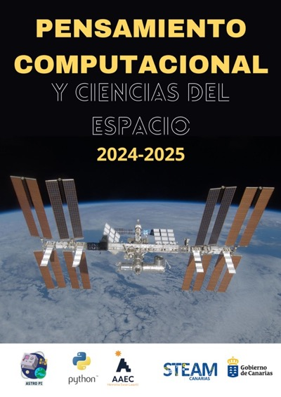

# astropi-matraka

Participación del [IES Puerto de la Cruz - Telesforo Bravo](https://www3.gobiernodecanarias.org/medusa/edublog/iespuertodelacruztelesforobravo/) en el desafío [Astro Pi Mission Space Lab](https://astro-pi.org/mission-space-lab).

> IES Puerto de la Cruz - Telesforo Bravo  
> C/Las Cabezas, 7. Puerto de la Cruz, CP 38400  
> 922380112

Esta iniciativa se engloba dentro del proyecto [Pensamiento Computacional y Ciencias del Espacio](docs/presentacion-pcce.pdf):



## El equipo

El equipo se llama **Matraka** y está compuesto por **Carla, Daniele y Aarón** de primer curso del CFGS de **Desarrollo de Aplicaciones Web**.


## Enlaces de interés

- [Descrbre dónde está ahora mismo la ISS](https://www.esa.int/Science_Exploration/Human_and_Robotic_Exploration/International_Space_Station/Where_is_the_International_Space_Station)
- [Conoce las Raspberry Pi de la ISS](https://www.youtube.com/watch?v=Dyn4kYYJbIY)
- [Mi primer programa en Raspberry Pi de la ISS](https://www.youtube.com/watch?v=pyhjdBbbrQw)
- [Comandos básicos de la RPi](https://view.genially.com/5ea5af9f63183e0d9437b732/horizontal-infographic-timeline-astropi-mision-zero)
- [Simulador de Python + Sense HAT](https://trinket.io/sense-hat)

## Librerías necesarias

- [sense-hat](https://pythonhosted.org/sense-hat/)
- [datetime](https://docs.python.org/es/3.13/library/datetime.html)
- [time](https://docs.python.org/es/3.13/library/time.html)
- [picamera](https://picamera.readthedocs.io/en/release-1.13/)
- [pillow](https://pillow.readthedocs.io/en/stable/)
- [pyephem](https://rhodesmill.org/pyephem/)
- [skyfield](https://rhodesmill.org/skyfield/)
- [orbit](https://github.com/0Pyonier1/G-_in_Space_Astro_Pi/issues/1)

⭐ El paquete `orbit` está incluido en el sistema operativo **Flight OS** de la RPi que se encuentra en la ISS.

## Sense HAT

```python
from sense_hat import SenseHat
sense = SenseHat()
```

### Sensores de entorno

| Función                   | Descripción                                        |
| ------------------------- | -------------------------------------------------- |
| `sense.get_temperature()` | Devuelve la temperatura en grados Celsius (ºC)     |
| `sense.get_humidity()`    | Devuelve la humedad relativa en porcentaje (%)     |
| `sense.get_pressure()`    | Devuelve la presión atmosférica en milibares (hPa) |

### Sensores IMU

La IMU (Unidad de medida inercial) es una combinación de tres sensores (magnetómetro, giroscopio y acelerómetro).

Cada uno de los sensores devuelve un diccionario con las medidas en los 3 ejes del espacio, con claves `x` `y` `z`.

### Magnetómetro

Intensidad del campo magnético (µT):

```python
sense.set_imu_config(compass_enabled=True, gyro_enabled=False, accel_enabled=False)
sense.get_compass_raw()
```

### Giroscopio

Orientación (º):

```python
sense.set_imu_config(compass_enabled=False, gyro_enabled=True, accel_enabled=False)
sense.get_gyroscope_raw()
```

### Acelerómetro

Aceleración (G):

```python
sense.set_imu_config(compass_enabled=False, gyro_enabled=False, accel_enabled=True)
sense.get_accelerometer_raw()
```

## Posición de la ISS

Se proporciona una función que devuelve el posicionamiento de la ISS:

```python
position = get_ISS_position()
```

El diccionario devuelto tiene las siguientes claves:

- `latitude` (º)
- `longitude` (º)
- `altitude` (km)

## Puesta en marcha

Desde una máquina **Linux** lleva a cabo los siguientes comandos:

**⚠️ EJECUTA LOS COMANDOS UNO POR UNO COMPROBANDO QUE NO HAYA ERRORES**

```bash
sudo apt-get install -y git curl
mkdir -p ~/bin
curl --proto '=https' --tlsv1.2 -sSf https://just.systems/install.sh | bash -s -- --to ~/bin
echo export PATH="$PATH:$HOME/bin" >> ~/.bashrc
echo alias j=just >> ~/.bashrc
source ~/.bashrc
curl -LsSf https://astral.sh/uv/install.sh | sh
source ~/.local/bin/env
cd
git clone git@github.com:iespuertodelacruz/astropi-matraka.git  # Debes estar autenticado!
cd astropi-matraka/src
```

Ahora podrás probar el fichero base ejecutando el siguiente comando:

```console
uv run main.py
```

También puedes ejecutarlo simplemente con:

```console
j
```
